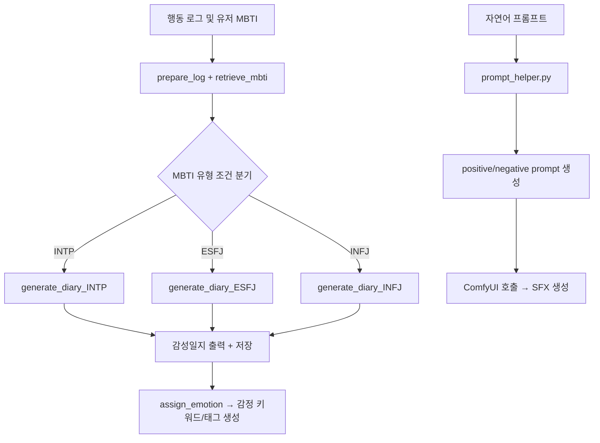

# ProjectISG-AI(현재 진행중)

**ProjectISG-AI**는 감성일지 생성, MBTI 분석, 행동 로그 관리, SFX 생성 등 다양한 기능을 제공하는 FastAPI 기반의 백엔드 프로젝트입니다. 해당 프로젝트는 단순한 AI 기술 시연을 넘어, 실제 게임 내 기능으로 적용 가능한 AI 모듈을 직접 설계·구현하여 게임 개발 및 서비스에 실질적인 도구로 활용하는 것을 핵심 목표로 합니다.

---

프로토타입 발표자료 링크(Canva) : [https://www.canva.com/design/DAGm2FBkNCA/_2F5ffQoJRMfjoidKDWaSQ/view?utm_content=DAGm2FBkNCA&utm_campaign=designshare&utm_medium=link2&utm_source=uniquelinks&utlId=h8e6b62348e]

---

## 📌 1️⃣ 프로젝트 개요

### 🚀 목표

* 게임 내 행동 로그를 바탕으로 감성일지를 자동 생성
* 유저 응답 기반의 MBTI 분석 및 결과 저장
* SFX 생성 API를 통해 게임 효과음을 자동화
* 행동 로그 및 스크린샷 업로드/조회 시스템 구축
* "AI가 게임 개발의 일부가 아닌, 실제 게임 기능을 돕는 도구로 작동할 수 있음을" 기술적으로 입증

### 🎯 주요 기능

1. **감성일지 생성**

   * LangGraph 기반 워크플로우에서 MBTI 성향과 게임 로그를 통합하여 감성적 표현이 포함된 일지 생성
2. **MBTI 분석**

   * 세션 기반의 질문/응답 흐름을 통해 성격 유형 유추 및 PostgreSQL에 저장
3. **행동 로그 관리**

   * 로그 업로드, 조회, 수정, 삭제 기능 및 스크린샷 첨부
4. **SFX 생성**

   * 자연어 프롬프트를 LLM으로 영어로 변환하고 긍정/부정 프롬프트로 분리 후, ELEVENLABS API로 스타일 기반 효과음 생성

---

## 📌 2️⃣ 사용 기술 스택

| 분야          | 사용 기술 및 라이브러리                                   |
| ----------- | ----------------------------------------------- |
| 백엔드 프레임워크   | FastAPI, Uvicorn                                |
| 데이터베이스      | PostgreSQL (SQLAlchemy), MongoDB (pymongo)      |
| 언어 모델 및 LLM | Ollama, LangChain, LangGraph                    |
| AI 모델 통합    | LLM 프롬프트 생성, 감성 일지 및 SFX 생성 등                   |
| 데이터 처리/유틸리티 | Pydantic, dotenv, Enum, shutil, pathlib         |
| 비동기/네트워크 통신 | requests, HTTP 기반 REST API                      |
| 노트북 환경      | Jupyter Notebook (Notebooks 폴더 내 실험/개발용 사용)     |
| 사운드 생성 연동   | ComfyUI API, 프롬프트 텍스트 포맷 변환                     |
| 기타          | GitHub, .env 환경 설정, black 코드 포매터, mermaid 다이어그램 |

## 📌 3️⃣ 프로젝트 아키텍처



* **LangGraph**: 상태 기반 감성일지 생성 파이프라인 구축
* **Ollama LLM**: 감성 표현 생성을 위한 LLM 호출
* **SFX/ComfyUI Translator**: 프롬프트 번역 및 효과음 생성 
* **SQLAlchemy + PostgreSQL**: 사용자 및 MBTI 세션 상태 관리, 로그 데이터 저장
* **MongoDB**: 감성일지, 감정 키워드, 감정 태그 저장

---

## 📌 4️⃣ API 명세 요약

### 📂 `/log` 관련 API

| HTTP Method | Endpoint                          | 설명                                |
|-------------|-----------------------------------|-------------------------------------|
| `POST`      | `/log/upload_with_screenshot`     | 행동 로그 및 스크린샷 업로드 및 저장         |
| `GET`       | `/log/logs`                       | 전체 행동 로그 조회                       |
| `DELETE`    | `/log/delete/{log_id}`            | 특정 행동 로그 삭제                       |
| `PUT`       | `/log/update/{log_id}`            | 특정 행동 로그 수정                       |
| `DELETE`    | `/log/diary/delete`               | Diary (MongoDB) 로그 삭제               |

---

### 📂 `/diary` 관련 API

| HTTP Method | Endpoint                          | 설명                                |
|-------------|-----------------------------------|-------------------------------------|
| `POST`      | `/diary/new_session`              | 새로운 Diary 세션 ID 생성                |
| `POST`      | `/diary/generate_diary`           | 행동 로그 기반 감성일지 생성 (DB 저장 X)      |
| `POST`      | `/diary/save_diary`               | 대표 이미지 선택 후 Diary 저장 (MongoDB)     |
| `POST`      | `/diary/get_all_diaries`          | 특정 유저/세션의 모든 감성일지 조회           |
| `POST`      | `/diary/regenerate_emotion`       | 기존 감성일지 텍스트 기반 감정 키워드 재생성    |
| `GET`       | `/diary/render_image/{image_name}`| 스크린샷 파일 이름 기반 이미지 반환           |

---

### 📂 `/mbti` 관련 API

| HTTP Method | Endpoint                      | 설명                                 |
|-------------|-------------------------------|--------------------------------------|
| `POST`      | `/mbti/ask`                   | MBTI 질문 생성                           |
| `POST`      | `/mbti/answer`                | MBTI 응답 제출 및 분석                     |
| `GET`       | `/mbti/result/{user_id}`      | 특정 유저의 MBTI 추론 결과 확인             |
| `GET`       | `/mbti/users?limit=N`         | 저장된 MBTI 유저 정보 일부 조회 + 전체 개수 반환 |

---

### 📂 `/etc` 관련 API

| HTTP Method | Endpoint                  | 설명                                         |
|-------------|---------------------------|----------------------------------------------|
| `POST`      | `/etc/sfx/generate`       | 자연어 프롬프트 기반 SFX 생성 및 다운로드 제공     |
| `POST`      | `/etc/comfyui/generate`   | ComfyUI용 포맷 변환 프롬프트 생성                |

---

## 📌 5️⃣ 세부 프로세스 설명

### ✍️ 감성일지 생성 LangGraph 흐름

* **입력**: `DiaryState(user_id, date, group(logs), mbti)`
* **노드 구성**:

  * `prepare_log`: 로그 그룹을 문자열로 통합
  * `retrieve_mbti`: 유저의 MBTI를 DB에서 조회
  * `assign_emotion`: 무작위 감정 태그와 키워드 지정
  * `generate_diary_{MBTI}`: MBTI에 따라 맞춤형 프롬프트 적용
  * `output`: 감성일지 결과 및 감정 키워드 반환 및 저장 및 오류 처리
* **출력 저장**: `Diary` 테이블과 `emotion_tags`, `emotion_keywords` MongoDB에 병렬 저장

### 🧠 MBTI 추론 로직

* 세션당 5개 문항에 대해 점수 집계 → I/E, S/N, T/F, J/P
* 점수 비교 기준으로 MBTI 결정
* 결과는 PostgreSQL의 `users` 테이블에 저장 및 조회 가능

### 🎧 SFX 생성 로직

* 입력 텍스트 → 영어 번역 
* 프롬프트 형식: 'prompt', 'duration', 'prompt_influence'
* ELEVENLABS API 호출
* 출력: mp3 파일로 반환

---

## 📌 6️⃣ 실행 방법

```bash
pip install -r requirements.txt
uvicorn app.main:app --reload --port 8000
```

* 환경 변수는 `.env`에서 관리 (예시: `.env.example` 참고)
* FastAPI Swagger 문서: [http://localhost:8000/docs](http://localhost:8000/docs)

---

## 📌 7️⃣ 프로젝트 구조 (실제 기준 정리)

```plaintext
📦 ProjectISG-AI
 ┣ 📂app
 ┃ ┣ 📜main.py                       # FastAPI 앱 실행 엔트리 포인트
 ┃ ┣ 📜routes.py                     # 모든 라우터 등록 및 API 통합
 ┃ ┣ 📜discord_bot.py                # Discord 챗봇 구성(SFX, 3D asset 생성)
 ┃ ┣ 📂api
 ┃ ┃ ┣ 📂diary
 ┃ ┃ ┃ ┣ 📜diary_generator.py        # LangGraph 기반 감성일지 생성 메인 로직
 ┃ ┃ ┃ ┣ 📜graph.py                  # LangGraph 노드 및 Edge 흐름 정의
 ┃ ┃ ┃ ┣ 📜prompt_diary.py          # 일지 생성 프롬프트 템플릿 정의
 ┃ ┃ ┃ ┣ 📜rag.py                    # 감성일지 관련 RAG 검색 로직
 ┃ ┃ ┃ ┗ 📜screenshot_selector.py    # 대표 스크린샷 자동 선택 알고리즘
 ┃ ┃ ┣ 📂mbti
 ┃ ┃ ┃ ┗ 📜logic.py                  # 세션 기반 MBTI 질문/응답 로직 및 저장
 ┃ ┃ ┣ 📂sfx
 ┃ ┃ ┃ ┣ 📜sfx_service.py            # SFX API 진입점 및 FastAPI 라우터 핸들링
 ┃ ┃ ┃ ┗ 📜sfx_translation.py        # SFX 프롬프트 변환 및 영어 번역, 긍/부정 구분
 ┃ ┃ ┣ 📂comfy
 ┃ ┃ ┃ ┣ 📜comfyui_service.py       # ComfyUI API 호출 래퍼
 ┃ ┃ ┃ ┗ 📜comfyui_translator.py    # ComfyUI 프롬프트 포맷으로 변환기
 ┃ ┣ 📂models
 ┃ ┃ ┣ 📜models.py                   # SQLAlchemy 모델 정의(User, Diary, Logs 등)
 ┃ ┃ ┗ 📜__init__.py                 # 패키지 초기화
 ┃ ┣ 📂utils
 ┃ ┃ ┣ 📜db_helper.py                # PostgreSQL 및 MongoDB 조회/저장 유틸 함수
 ┃ ┃ ┣ 📜log_helper.py               # 로그 전처리 및 그룹핑, 필터링 기능
 ┃ ┃ ┣ 📜log_parser.py               # 로그 분석 및 구조화 유틸 함수
 ┃ ┃ ┣ 📜image_helper.py             # 스크린샷 경로 및 이미지 관련 유틸
 ┃ ┃ ┣ 📜prompt_helper.py            # SFX 자연어 프롬프트 분석 및 구성
 ┃ ┃ ┣ 📜sfx_helper.py               # SFX 관련 키워드 파싱 및 태그 생성
 ┃ ┃ ┣ 📜mbti_helper.py              # MBTI 성향 이름 매핑 및 관련 유틸
 ┃ ┃ ┣ 📜agent_tools.py              # Agent 실행 및 태스크 흐름 유틸
 ┃ ┃ ┗ 📜action_enum.py              # 행동 로그 액션 분류용 Enum
 ┃ ┣ 📂core
 ┃ ┃ ┣ 📜config.py                   # 환경변수 로딩 및 설정
 ┃ ┃ ┗ 📜database.py                 # SQLAlchemy DB 세션 및 Mongo 연결 초기화
 ┣ 📂DB                              # DB 초기 SQLite 파일 저장 위치
 ┣ 📂static                          # 업로드된 스크린샷, 프론트 정적 리소스 저장 경로
 ┣ 📂Notebooks                       # 실험 및 개발용 Jupyter Notebook 저장 폴더
 ┣ 📜requirements.txt               # 프로젝트 전체 의존성 정의 파일
 ┣ 📜openapi.json                   # FastAPI 자동 생성 API 명세서
 ┣ 📜CONTRIBUTING.md                # 협업 및 커밋 가이드 문서
```

---

## 📌 8️⃣ 프로젝트 회고 및 느낀 점

* 게임에 AI를 통합하는 방식은 단순한 대화형 응답이나 NPC 제어를 넘어서, **게임 시스템의 일부로 AI 기능을 내재화하는 방향**으로 나아가야 함을 체감함
* 감성일지 생성 및 MBTI 기반 텍스트 생성은 **게임 몰입도를 높이는 요소**로 작용할 수 있음을 실험적으로 검증
* LangGraph의 도입은 감정 기반 일지 생성에 있어 각 단계를 구조화하고 디버깅을 용이하게 했으며, 상태 기반 흐름 구성 및 오류 처리에 대한 이해를 높였음
* MongoDB와 SQL 계열 DB를 병렬로 사용하는 과정에서 ORM과 NoSQL 설계의 차이를 직접 체감하며, 설계 기준과 선택 이유를 명확히 이해하게 되었음
* 단일 기능 API보다는 복합 정보 흐름을 기반으로 하는 API 구성 전략을 배우고 직접 설계해본 점이 실무 활용에 있어 큰 자산이 되었음

---

## 📌 9️⃣ 향후 발전 및 확장 방안

* **LLM 파인튜닝**: 실제 유저 로그 기반의 도메인 특화 파인튜닝을 통해 감성일지 표현의 다양성과 몰입도 향상
* **RAG 기반 NPC 대화 시스템**: 기존 행동 로그 및 감정 기반 데이터를 활용해, 유저 맞춤형 NPC 대화 시스템으로 확장 가능
* **SFX 자동화 파이프라인 강화**: 게임 이벤트 발생 시, 즉시 프롬프트 추출 → 효과음 생성까지 자동화하는 흐름으로 확장
* **WebSocket 기반 실시간 연동 전환**: 클라이언트가 게임 서비스로 확장될 경우, 실시간 상호작용을 위해 API 통신에서 WebSocket 구조로 전환 고려
* **Game Engine 연동 모듈화**: Unity/Unreal 등에서 직접 사용할 수 있도록 FastAPI 라우터를 플러그인 또는 라이브러리 형태로 래핑 예정
* **게임 외적 활용 방안**: AI 감성일지 생성을 심리 상담, 자기성찰, 일기장 애플리케이션으로 확장하거나, SFX 자동 생성 기능을 영상 제작/사운드 디자인 도구로 활용하는 것도 가능

---

## ✅ 협업 및 기여 전략

* 커밋: `Conventional Commits` 준수 (예: `feat:`, `fix:`)
* 코드 스타일: `black` 포매터 사용
* 브랜치: 기능별 브랜치 → PR 후 main에 병합
* Jupyter 작업물: `/Notebooks/{이름}` 구조 유지
* 설정 공유: `.env.example`을 통한 공통 환경 변수 관리
